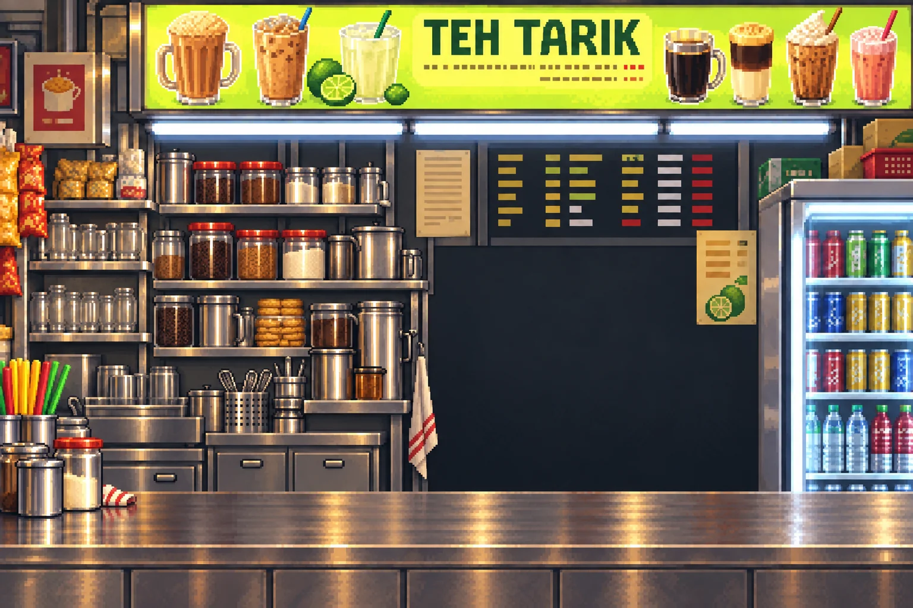

# Our Block

Singapore memories you can walk into—and play together.

Explore neighbourhood life in a 2.5D world, then challenge your friends to flag erasers, Teh Tarik!, Singapore Skyways, Last Order, Lah! and Getai Groove. A shared computer brings everyone together; phones become the controllers.

**[Play Our Block](https://our-block-kaki.dangerouspotential.chatgpt.site) · [Art & generation workflow](docs/ART-WORKFLOW.md)**


## Built with Astra and GPT Image 2.5

**GPT Image 2.5 supplied the game's visual identity and playable image assets. Astra connected that artwork to the world, the mechanics and the multiplayer experience.** We used Astra with the Product Design skill to explore visual directions, refine scenes from feedback, and turn generated images into a coherent Singapore neighbourhood game.

The image work spans the whole experience:

| Where you see it | What we generated | How it becomes part of play |
| --- | --- | --- |
| Characters | Eight Singapore-inspired mascots and four fictional neighbours across three life stages | Reusable sprite atlases for character selection, world residents and minigames |
| Neighbourhoods | Era-inspired world references, lobby scenes and surface artwork | Visual direction for editable Blender worlds, with generated textures and sprites integrated into the scene |
| Teh Tarik! | A Singapore drinks stall and a separate pixel-art pourer | Layered artwork leaves space for live tea, moving cups, foam and scoring |
| Flag erasers | A pixel-art classroom showdown background | The game composites each player's selected character and moving erasers into the scene |
| Last Order, Lah! | Kopi, kaya toast, kueh and laksa in a transparent food atlas | Individual dishes become readable, interactive order choices |
| Getai Groove & Singapore Skyways | A Singapore getai concert backdrop, climbing scenery and supporting props | Playable lanes and platforms sit over artwork composed for clear action |

The important step was making the art **work inside a game**: consistent character references, empty space for controls and moving objects, measured sprite crops, transparent layers, and alignment between illustrated scenery and live interactions. Saved prompts and renderer links make that process inspectable in the [art workflow](docs/ART-WORKFLOW.md).



## How Astra shaped Our Block

We asked for a small microcosm of everyday Singapore life. Astra helped develop that direction into neighbourhood scenes with residents playing, gathering, travelling and working, alongside familiar places and pastimes. Historical research informed the era details; the maps remain stylised composites.

Astra supported brainstorming, Product Design iterations, Blender scene construction, sprite integration and ambient choreography. It also helped translate the shared-screen party idea into QR phone joining, game-specific controls, room state, scoring and reconnect handling, then refine the experience through playtesting and feedback.

**Attribution:** GPT Image 2.5 created image assets; Blender supplied 3D geometry; Astra authored and integrated the software and animation behaviour. Music and external media have separate credits. The preserved generation records identify the built-in ImageGen tool; GPT Image 2.5 is the team's model attribution.

## Play

1. Open [Our Block](https://our-block-kaki.dangerouspotential.chatgpt.site) on the central computer.
2. Choose **Download all assets** in the lobby and wait for completion before entering God Mode. Use a reliable connection or mobile hotspot if venue Wi-Fi is slow.
3. Explore the worlds, or open `/display` for a party and scan the QR code from each phone.

Downloaded artwork is cached in that browser. This public snapshot includes the **1950s and 1987** worlds and a 47-file asset download of about 35 MB. The hosted game may include later updates. Multiplayer still needs a network connection; downloading artwork does not remove network latency. Optional motion and microphone controls require compatible devices and browser permissions.

## Run locally

Requires Node.js 22.13 or newer.

```sh
git clone https://github.com/DangerousPotential/our-block-sites.git
cd our-block-sites
npm ci
npx wrangler d1 execute DB --local --config wrangler.local.jsonc --file drizzle/0000_conscious_avengers.sql
npm run dev -- --hostname 0.0.0.0 --port 3000
```

Open http://localhost:3000 on the central computer. Phone controllers must be able to reach its network address. Browser asset caching requires HTTPS or localhost.

## Checks

```sh
node --test tests/asset-cache.test.mjs
node --import ./tests/register.mjs --test tests/phone-motion.test.mjs tests/god-mode.test.mjs tests/getai.test.mjs
npx tsc --noEmit
npm run build
```

## Sites hosting

This edition uses Cloudflare D1 (`DB`) and R2 (`WORLD_ASSETS`) through Sites. Register your own Sites project and add its project ID to `.openai/hosting.json`. The build separates large assets from the application archive. Configure your own `ASSET_UPLOAD_TOKEN` and use `scripts/upload-storage-assets.mjs` with `OUR_BLOCK_UPLOAD_ORIGIN` and `OUR_BLOCK_UPLOAD_TOKEN` to populate your storage. Never commit tokens.

All runtime assets are included for local development. Historical design files and retired worlds are omitted. Regenerating source art requires the original authoring files.

## Submission provenance

This public snapshot preserves source checkpoint `2e827e727db44ee550bb59211cd02eb04fb68532` with publication documentation and a project-neutral hosting configuration. The hosted asset-download release was built from `f074ee946f85632859e92a32d0e9ea1ebff596b3`; this snapshot also includes the subsequently saved phone-control changes. The documentation update adds the art workflow and Astra attribution without changing that game snapshot.

## License

Original project code is available under the MIT License. Third-party dependencies, services, music, brands, and media retain their respective licenses and rights. Existing asset credits are preserved under `public/`. No recorded music files are bundled in this snapshot; embedded playback uses external services.
