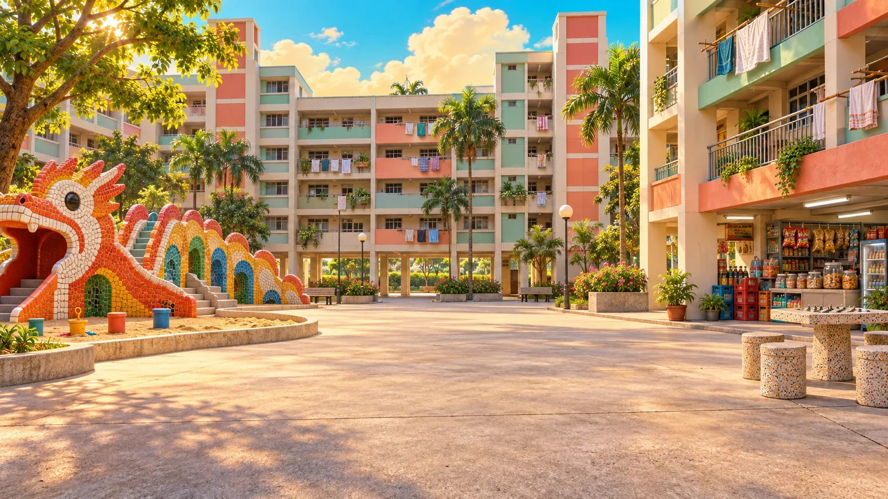
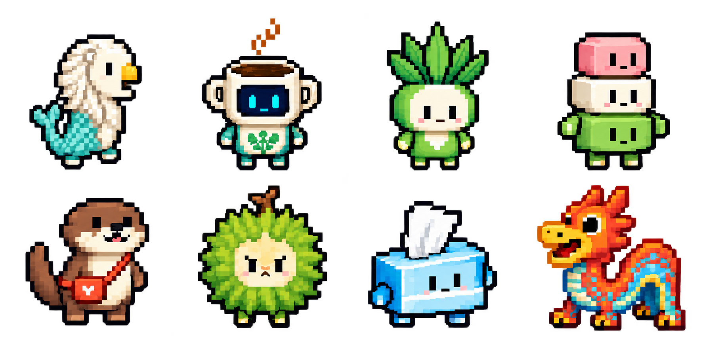

# Our Block

Singapore memories you can walk into—and play together.

Pick a kopi-cup robot, a kueh or a neighbourhood dragon. Wander through Singapore's past, pull teh tarik, flick flag erasers and meet your friends at the getai. One shared screen. Your phones. A whole block of memories.

**[Play Our Block](https://our-block-kaki.dangerouspotential.chatgpt.site) · [Explore the artwork](docs/ART-WORKFLOW.md) · [Run locally](docs/DEVELOPMENT.md)**

## Familiar places. Playable memories.

Explore the 1950s and 1987: cinema outings, neighbourhood gatherings, void decks and playgrounds. Residents bring everyday activity to the streets. The worlds draw on historical research and local references, with stylised layouts that connect places for exploration.

Then bring your friends into five games:

| Game | Your challenge |
| --- | --- |
| Flag Erasers | Aim and flick across the school desk. |
| Teh Tarik! | Keep your cup under the pour. |
| Singapore Skyways | Climb through Singapore-inspired scenery. |
| Last Order, Lah! | Match the orders with kopi, toast, kueh and laksa. |
| Getai Groove | Hit the rhythm lanes beneath the stage lights. |

## Singapore, drawn for play

**GPT Image 2.5 helped turn everyday Singapore into the characters you choose, the places you visit and the food you serve.** Its artwork carries Our Block's identity from the neighbourhood to the minigames.

### A cast that belongs to the block

Eight mascots turn local favourites into playable personalities: kopi, pandan, kueh, an otter, durian, a tissue packet, a mosaic dragon and a Merlion-inspired character. Four fictional neighbours appear across three life stages. The same roster carries into world exploration and the classroom showdown.

[Character artwork and original prompts](public/assets/prompts.json)

### Artwork that makes room for the action

In **Teh Tarik!**, the drinks stall and pourer are separate image layers, leaving the tea and cups free to move with play. In **Flag Erasers**, the classroom matches the existing pixel roster, so your chosen character belongs in the showdown. In **Last Order, Lah!**, distinct dishes and matching floral porcelain make the order choices easy to recognise.

Those details came through reference-guided generation and edits: refining the pouring pose, matching the classroom to the characters, and preserving each dish's shape and colour. Each image has a job in the game.

[Teh Tarik artwork](public/assets/party/TEH-TARIK-ART.md) · [Classroom artwork](public/assets/eraser/ART.md) · [Food artwork](public/assets/party/HAWKER-ART.md)

### A neighbourhood across generations

Era-inspired lobby scenes and world references establish the atmosphere; Blender worlds make the neighbourhoods explorable. Generated sprites, surface artwork and minigame scenery connect the larger world to its everyday pastimes—from the drinks stall to the getai stage.

[See how the artwork becomes part of play](docs/ART-WORKFLOW.md)

## Made with Astra

Astra helped shape Our Block from the idea of a living Singapore neighbourhood into shared-screen play: creative direction, Product Design iterations, Blender scene work, character integration and phone controls. We steered the experience through references, playtesting and feedback. GPT Image 2.5 supplied image artwork; Blender supplied 3D geometry; Astra helped implement the game and its animation behaviour.

## Play together

1. Open [Our Block](https://our-block-kaki.dangerouspotential.chatgpt.site) on the central computer.
2. Choose **Download all assets** and wait for completion before entering God Mode. A mobile hotspot can help if venue Wi-Fi is slow.
3. Explore, or open the [party display](https://our-block-kaki.dangerouspotential.chatgpt.site/display) and scan the QR code with each phone.

Keep everyone connected throughout the game. Optional motion and microphone controls need a compatible browser and permission.

This repository includes the 1950s and 1987 worlds. The hosted game may include later updates. See the [development guide](docs/DEVELOPMENT.md) for setup, checks and release details.

## Credits

Image artwork: GPT Image 2.5, used through Codex's built-in ImageGen tool. Creative and engineering assistance: Astra, with Product Design and Blender. [Generation records and attribution details](docs/ART-WORKFLOW.md).

Original project code is available under the [MIT License](LICENSE). Third-party dependencies, services, music, brands and media retain their respective rights. Existing media credits are preserved under `public/`; no recorded music files are bundled in this snapshot.
